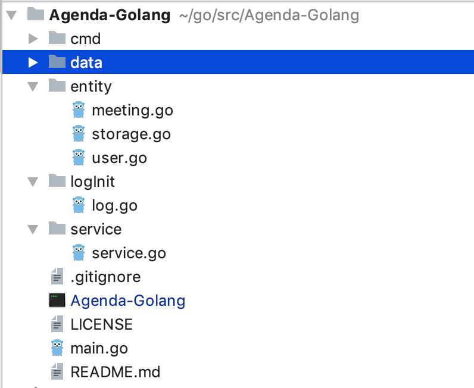

# Agenda-Golang Readme

### 小组成员及分工

| 学号 | 姓名 | 工作 |
| --- | --- | --- |
| 16340309 | 钟文谦 | 结构设计Service部分 |
| 16340308 | 钟霖 | Entity部分的完成 |
| 16340298 | 章恒 | Cmd部分的完成 |

### 基本设计
首先，使用cobra新建我们的项目，然后按照要求所说的创建entity存放User和Meeting对象读写与处理逻辑，这里参考实训时候的程序，我们在该entity包中创建了Storage.go，以提供User和Meeting的对象读写。

基本项目结构如下

### cmd命令设计

- 注册
	- Command: `register -u=username -p=password -m=mail -n=phoneNumber`
	- Parse:
		- -u:用户名
		- -p:密码
		- -m:邮箱地址
		- -n:手机号码
	- Extra
		- 用户名不能使用已经注册的用户名
- 登录
	- Command: `signIn -u=username -p=password`
	- Parse:
		- -u: 用户名
		- -p: 密码
    - Extra:
        - 若密码输入错误，提示错误信息
- 登出
	- Command: `logout`
	- No Parse
	- Extra:
		- 要先登录才能登出，否则提示出错
- 查询所有用户
	- Command: `queryuser`
	- No Parse
- 删除账户
	- Command: `deleteuser`
	- No Parse
	- Extra: 
		- 要先登录才能删除登陆的用户，否则提示出错信息
		- 如有用户登录则删除用户作为发起者的会议，同时将用户从作为参与者的会议中删除
- 创建会议
	- Command: `createmeeting -t=title -p=participator -s=starttime -e=endtime`
	- Parse:
		- -t : 会议标题
		- -p: 参与者(可添加多个)
		- -s: 开始时间
		- -e: 结束时间
	- Extra:
		- 只允许已登录用户进行此操作
		- 会议标题具有唯一性
		- 参与者数量 >= 1，若需要添加多个参与者，用`,`隔开，且添加的参与者需为已注册的用户
		- 开始时间与结束时间应符合逻辑，有固定输入格式，如：`[2006-01-02 15:04:05]`
		- 不允许发起者或参与者在此时间段内有其他会议
- 编辑会议参与者
	- Command: `editparticipator -t=title -p=participator`
	- Parse:
        - -w: 增加或者删除会议参与者
		- -t: 会议标题
		- -p: 参与者列表
	- Extra:
        - -w参数决定增加还是删除会议参与者，`-w=add`则添加会议参与者，`-w=delete`则删除会议参与者
		- 仅允许已登录用户对自己发起的仍存在的会议进行增加操作, 否则返回出错信息
		- 参与者必须为注册用户
		- 参与者同样需要检查会议时间段内是否空闲
- 会议查询
	- Command: `querymeeting -s=starttime -e=endtime`
	- Parse:
		- -s : 开始时间
		- -e : 结束时间
    - Options:
        - -t : 会议标题
	- Extra:
        - 可以直接通过会议的开始和结束时间来查询会议
        - 也可以通过会议的标题来查询会议
        - 只能通过前两种方式中的一种来查询，若两个方法同时使用了提示错误信息
		- 已登录的用户可以查询自己的议程在某一时间段(time interval)内的所有会议安排。
		- 在列表中给出每一会议的起始时间、终止时间、主题、以及发起者和参与者。
		- 注意，查询会议的结果应包括用户作为`发起者或参与者`的会议。
- 取消会议
	- Command: `deletemeeting -t=title`
	- Parse:
		- -t : 会议标题
	- Extra:
        - 只允许已登录用户进行此操作
		- 而且仅允许已登录用户删除自己发起的会议
- 退出会议
	- Command: `exitMeeting-t=title`
	- Parse:
		- -t: 会议标题
	- Extra:
        - 只允许已登录用户进行此操作
		- 而且仅允许该登录用户退出自己参加的会议
		- 若因此导致该会议参与人数为0则删除会议
- 清空会议
	- Command: `clearmeetings`
	- No Parse
	- Extra:
        - 只允许已登录用户进行此操作
		- 只能删除由已登录用户发起的所有会议

### 测试

### 体会

